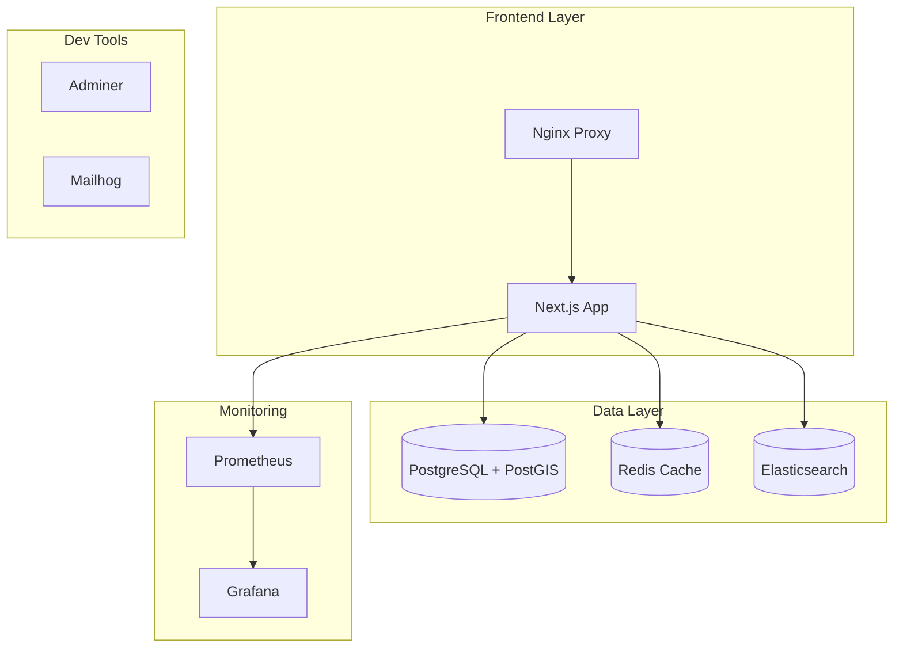

# 🐳 Docker Development Workflow Guide

## Production-Grade Development Environment for Sober Living Facilities Finder

### 📋 Table of Contents
- [Overview](#overview)
- [Quick Start](#quick-start)
- [Architecture](#architecture)
- [Services](#services)
- [Development Workflow](#development-workflow)
- [Monitoring & Debugging](#monitoring--debugging)
- [Troubleshooting](#troubleshooting)
- [Best Practices](#best-practices)

## Overview

This Docker development environment models our production architecture locally, providing:
- 🚀 **Hot-reload** development with instant code changes
- 📊 **Full monitoring stack** with Prometheus and Grafana
- 🗄️ **Production-grade databases** with PostGIS and Redis
- 🔍 **Elasticsearch** for advanced search capabilities
- 🛠️ **Development tools** including Adminer and Mailhog
- ⚖️ **Load balancing** with Nginx reverse proxy
- 🏥 **Health checks** for all services

## Quick Start

### Prerequisites
- Docker Desktop 4.0+ installed
- 8GB+ RAM allocated to Docker
- Port availability: 80, 443, 3000, 3001, 5432, 6379, 8080, 8025, 9090, 9200

### 🚀 Start Development Environment

```bash
# 1. Clone the repository
git clone https://github.com/hackingco/soberlivings-finder.git
cd soberlivings-finder

# 2. Copy environment template
cp .env.development .env

# 3. Start all services
make dev

# 4. Wait for services to be healthy (automated)
# The system will show you all available URLs when ready
```

### 📝 Available URLs

After startup, access these services:

| Service | URL | Description |
|---------|-----|-------------|
| **Frontend** | http://localhost:3000 | Next.js application |
| **API** | http://localhost:3000/api | REST API endpoints |
| **Grafana** | http://localhost:3001 | Monitoring dashboards (admin/admin) |
| **Adminer** | http://localhost:8080 | Database management UI |
| **Mailhog** | http://localhost:8025 | Email testing interface |
| **Prometheus** | http://localhost:9090 | Metrics collection |
| **Elasticsearch** | http://localhost:9200 | Search engine |

## Architecture



## Services

### 🎯 Core Application

#### Frontend (Next.js)
- **Container**: `soberlivings_frontend_dev`
- **Port**: 3000 (app), 9229 (debugger)
- **Features**:
  - Hot-reload enabled
  - TypeScript support
  - Prisma ORM
  - Debug port exposed

#### PostgreSQL + PostGIS
- **Container**: `soberlivings_postgres_dev`
- **Port**: 5432
- **Features**:
  - Spatial queries support
  - Auto-migration on startup
  - Performance tuning for development
  - Query logging enabled

#### Redis Cache
- **Container**: `soberlivings_redis_dev`
- **Port**: 6379
- **Configuration**:
  - 256MB memory limit
  - LRU eviction policy
  - Persistence enabled

#### Elasticsearch
- **Container**: `soberlivings_elasticsearch_dev`
- **Port**: 9200
- **Features**:
  - Full-text search
  - Geo-spatial queries
  - Auto-indexing

### 📊 Monitoring Stack

#### Prometheus
- Metrics collection every 15s
- Service discovery configured
- Custom application metrics

#### Grafana
- Pre-configured dashboards
- Multiple datasources
- Real-time monitoring

### 🛠️ Development Tools

#### Adminer
- Web-based database management
- Support for PostgreSQL
- No installation required

#### Mailhog
- SMTP testing server
- Web UI for email preview
- Zero configuration

## Development Workflow

### 🔄 Daily Development

```bash
# Start environment
make dev

# View logs
make logs           # All services
make logs-frontend  # Frontend only
make logs-db       # Database only

# Run tests
make test

# Database operations
make db-migrate    # Run migrations
make db-seed       # Seed with sample data

# Access container shell
make shell

# Health check
make health
```

### 🗄️ Database Management

```bash
# Backup database
make backup

# Restore from backup
make restore

# Access database UI
open http://localhost:8080
# Server: postgres
# Username: postgres
# Password: postgres
# Database: soberlivings
```

### 🔍 Elasticsearch Operations

```bash
# Check cluster health
curl http://localhost:9200/_cluster/health

# List indices
curl http://localhost:9200/_cat/indices

# Search facilities
curl -X GET "localhost:9200/facilities/_search?q=california"
```

### 📈 Monitoring

```bash
# Open monitoring dashboards
make monitor

# Grafana credentials
# Username: admin
# Password: admin

# View metrics directly
curl http://localhost:9090/metrics
```

## Monitoring & Debugging

### 📊 Available Dashboards

1. **Application Performance**
   - Request rates and latencies
   - Error rates
   - Database query performance

2. **Infrastructure Monitoring**
   - Container resource usage
   - Database connections
   - Cache hit rates

3. **Business Metrics**
   - Search queries
   - Facility views
   - API usage

### 🐛 Debugging

#### Node.js Debugging
```bash
# Attach debugger to port 9229
# VSCode: Use "Docker: Attach to Node" configuration

# Chrome DevTools
chrome://inspect
# Click "inspect" on the frontend target
```

#### Database Debugging
```sql
-- View active queries
SELECT * FROM pg_stat_activity WHERE state = 'active';

-- Check slow queries
SELECT * FROM pg_stat_statements ORDER BY total_time DESC LIMIT 10;

-- View table sizes
SELECT 
    schemaname,
    tablename,
    pg_size_pretty(pg_total_relation_size(schemaname||'.'||tablename)) AS size
FROM pg_tables
ORDER BY pg_total_relation_size(schemaname||'.'||tablename) DESC;
```

#### Container Debugging
```bash
# Execute commands in container
docker exec -it soberlivings_frontend_dev sh

# View container stats
docker stats

# Inspect container
docker inspect soberlivings_frontend_dev
```

## Troubleshooting

### Common Issues

#### 1. Port Already in Use
```bash
# Find process using port
lsof -i :3000

# Kill process
kill -9 <PID>
```

#### 2. Database Connection Failed
```bash
# Check if PostgreSQL is running
docker ps | grep postgres

# Restart database
docker-compose -f docker-compose.development.yml restart postgres

# Check logs
docker logs soberlivings_postgres_dev
```

#### 3. Out of Memory
```bash
# Increase Docker memory
# Docker Desktop > Preferences > Resources > Memory > 8GB+

# Clean up unused resources
docker system prune -a --volumes
```

#### 4. Slow Performance
```bash
# Check resource usage
docker stats

# Restart specific service
docker-compose -f docker-compose.development.yml restart <service>

# Rebuild without cache
make build
```

### 🔄 Reset Everything
```bash
# Complete cleanup and fresh start
make clean
make build
make dev
```

## Best Practices

### 🏗️ Development Tips

1. **Use Make commands** - Consistent and tested workflows
2. **Monitor resources** - Keep Grafana open during development
3. **Check health regularly** - `make health` before debugging
4. **Commit .env.example** - Never commit actual .env files
5. **Use container names** - Reference by name, not IP

### 🔒 Security

1. **Change default passwords** before deploying
2. **Use secrets management** for production
3. **Enable SSL/TLS** in production
4. **Implement rate limiting** for APIs
5. **Regular security updates** for base images

### 📈 Performance

1. **Cache aggressively** - Use Redis for session and API caching
2. **Optimize queries** - Monitor slow queries in Grafana
3. **Use indexes** - Spatial and text indexes for search
4. **Limit resources** - Set memory/CPU limits per container
5. **Profile regularly** - Use monitoring to find bottlenecks

## 🚀 Production Deployment

This development environment closely models production. To deploy:

1. **Update environment variables** in `.env.production`
2. **Enable security features** (SSL, authentication)
3. **Configure external services** (managed databases, CDN)
4. **Set resource limits** appropriate for production
5. **Enable backup strategies** for data persistence

```bash
# Build for production
docker-compose -f docker-compose.yml build

# Deploy to production
make prod
```

## 📚 Additional Resources

- [Docker Compose Documentation](https://docs.docker.com/compose/)
- [Next.js Docker Deployment](https://nextjs.org/docs/deployment#docker-image)
- [PostgreSQL with PostGIS](https://postgis.net/documentation/)
- [Elasticsearch Guide](https://www.elastic.co/guide/index.html)
- [Prometheus Monitoring](https://prometheus.io/docs/)
- [Grafana Dashboards](https://grafana.com/docs/)

## 🤝 Support

For issues or questions:
1. Check the [Troubleshooting](#troubleshooting) section
2. Review container logs: `make logs`
3. Open an issue on GitHub
4. Contact the development team

---

**Built with ❤️ by the Hive Mind Orchestrator**

*Last Updated: 2025-08-29*